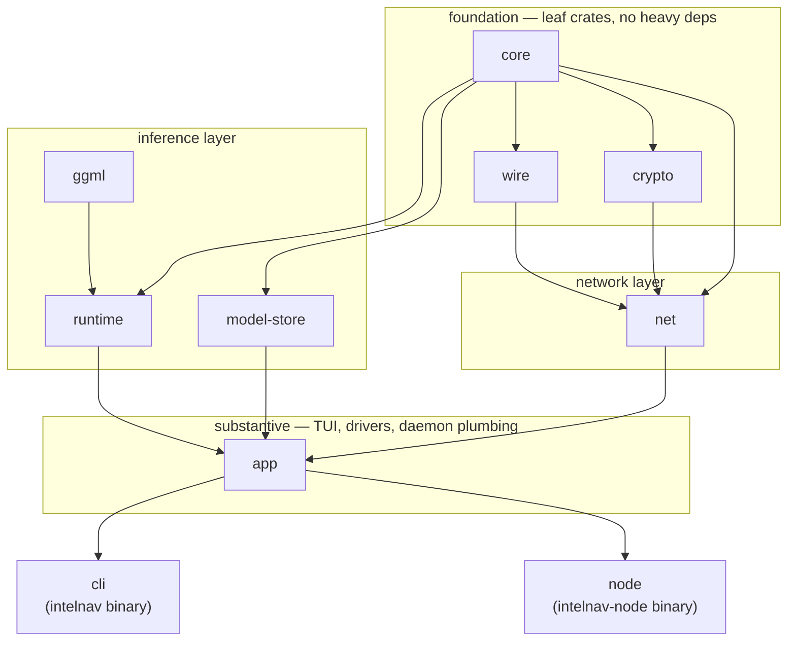

# IntelNav

**The model is the network.**

[intelnav.net](https://intelnav.net) ·
[live demo](https://intelnav.net/demo/) ·
[install](https://intelnav.net/install/) ·
[sovereignty](https://intelnav.net/sovereignty/) ·
[architecture](docs/architecture.md)

---

IntelNav splits a model into layer-range slices, scatters them across
volunteer hardware, and streams hidden states through the chain to
answer a prompt. **No single peer holds the whole model.** Slices are
addressed on a Kademlia DHT, signed at the edge, and pulled on demand;
contributors only commit RAM for the slice they have headroom to host.


**Every peer must contribute.** You either host a slice or run as a
DHT relay. There is no leech mode — without contribution, the swarm
collapses into the people running it.

## Install

```bash
curl -fsSL https://intelnav.net/install.sh | sh
```

Linux only for now. macOS and Windows follow once Linux is stable in
the wild. From source: see [Install](https://intelnav.net/install/).

## Why decentralized

Centralized AI providers see and log every prompt — code, medical
questions, business plans, half-formed political opinions. One
company, perfect introspection. IntelNav splits the computation so
**no single operator sees the whole of it**: only the entry peer
sees plaintext; every downstream peer sees opaque hidden-state
tensors. Noise XX (X25519 + AES-256-GCM) on every hop. Ed25519
identities. Signed slice advertisements.

A 4-hop chain is slower than a single datacenter call today —
that's honest physics. Tor was slow in 2003. BitTorrent was slow
in 2002. Network effects invert the curve as more peers join. The
[full threat model](https://intelnav.net/sovereignty/) is on the
website.

## Two binaries

| binary          | role                                                                              |
| --------------- | --------------------------------------------------------------------------------- |
| `intelnav`      | Chat client. TUI for picking models, hosting slices, and managing the daemon.     |
| `intelnav-node` | Host daemon. Holds slices, serves chunks, accepts inference forwards. Systemd user service. |

Both share the same identity (`~/.local/share/intelnav/peer.key`) and
`models_dir`, so they cooperate without IPC. The chat client also
talks to the daemon over a Unix socket (`control.sock`) for
status / leave / service operations.

## Quickstart from source

```bash
bash scripts/provision.sh                # system deps + rust + libllama
cargo build --release -p intelnav-cli -p intelnav-node
./target/release/intelnav                # opens the TUI
```

First launch:

1. The TUI generates `~/.config/intelnav/config.toml`, an Ed25519
   identity, and an empty `models_dir`. No file editing required.
2. It fetches a freshly-signed bootstrap seed list from the project's
   GitHub release and caches it locally.
3. You're shown a contribution gate. Pick a slice your hardware can
   host, or opt into relay-only mode. Chat is unlocked once you've
   chosen.
4. Selecting a slice runs the contribute flow (download / split or
   swarm pull), then asks `pkexec` once for permission to install
   `intelnav-node` as a user service. The daemon survives reboots
   from then on — no `systemctl` to type, ever.

Inside the TUI:

- `/models` — three-source picker: cached locally, advertised on the
  swarm, available from HuggingFace.
- `/hosting` — slices you currently host with active chain counts;
  drain a slice gracefully with `/leave <cid> <start> <end>`.
- `/service status|install|uninstall` — manage the systemd unit.

## Try the multi-peer chain on one box

```bash
bash scripts/local-swarm.sh setup           # prepare three peer dirs
bash scripts/local-swarm.sh start           # spawn three intelnav-node daemons
bash scripts/local-swarm.sh ask "what is 17 squared?"
bash scripts/local-swarm.sh stop
```

Three daemons split layers 6..24 of Qwen 2.5 · 0.5B; the chat client
runs layers 0..6 plus the head and forwards through the chain. Every
wire is the real protocol — the only sandbox is "all on one box."
Replace the loopback addresses with real hosts and you have a
multi-machine swarm. Source: [`scripts/local-swarm.sh`](scripts/local-swarm.sh).

## What `intelnav-node` runs

One process, one systemd unit:

- libp2p swarm with periodic provider record re-announce (5 min).
- Chunk HTTP server (multi-shard, keyed by manifest_cid).
- Forward TCP listener (lazy-loads each slice's GGUF on first
  request, stitches subsets when only chunks are on disk).
- Control RPC over `control.sock` so the chat client can drive
  hosting from the TUI.
- Drain watchdog that force-stops Draining slices whose grace
  period (5 min) elapses, so a wedged consumer can't pin a host
  forever.

## Crate layout



```
intelnav/
├── crates/
│   ├── core/             shared types, config, errors
│   ├── wire/             CBOR codecs for the protocol
│   ├── crypto/           Ed25519, X25519, AES-256-GCM
│   ├── ggml/             libllama loader + GPU probe
│   ├── runtime/          layer-range inference (ggml-backed)
│   ├── model-store/      GGUF chunker, stitcher, fetcher, multi-shard chunk server
│   ├── net/              libp2p + Kademlia DHT shard index
│   ├── app/              substantive code: TUI, drivers, contribute paths,
│   │                     daemon-hosted forward + chunk + control servers
│   ├── cli/              `intelnav` — chat client (thin binary over `app`)
│   └── node/             `intelnav-node` — host daemon (thin binary over `app`)
├── docs/
│   ├── architecture.md     workspace + protocol overview
│   ├── onboarding-host.md  how to host slices
│   └── onboarding-user.md  how to chat (still mandatory: pick a slice or relay)
├── scripts/
│   ├── provision.sh        system deps + rust + libllama
│   └── local-swarm.sh      reproducible 3-peer chain on one machine
└── specs/                  wire protocol
```

## Related repos

- [`IntelNav/llama.cpp`](https://github.com/IntelNav/llama.cpp) — patched
  libllama fork. Layer-range forward + partial-model loader; CI builds
  prebuilt tarballs that `intelnav-node` `dlopen`s at runtime.
- [`IntelNav/web`](https://github.com/IntelNav/web) — the
  [intelnav.net](https://intelnav.net) site. Next.js, static export,
  deployed to seed1's nginx.

## License

Apache-2.0.
