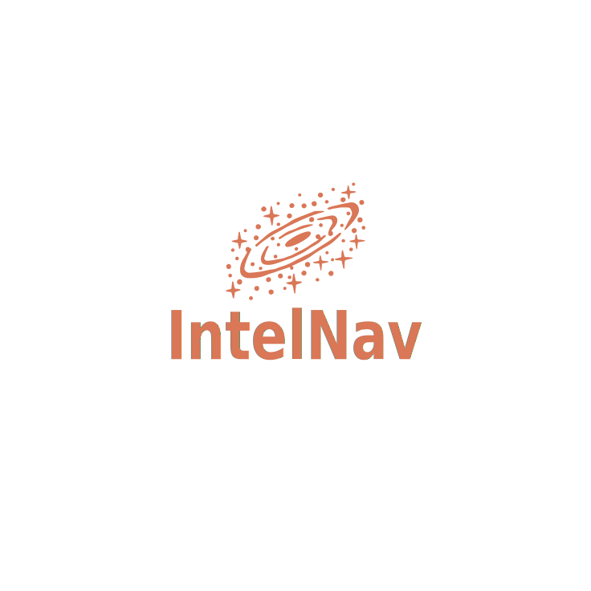

<p align="center">
  
</p>

<h1 align="center">IntelNav</h1>

<p align="center">
  <strong>Decentralized, pipeline-parallel LLM inference on ordinary hardware.</strong>
</p>

<p align="center">
  <a href="https://github.com/IntelNav/IntelNav/actions/workflows/ci.yml">
    
  </a>
  
  
</p>

---

IntelNav chops a large language model into layer slices, spreads the
slices across peers, and streams hidden states through the chain to
answer a prompt. No single peer holds the whole model; prompts are
encrypted end-to-end; the API is OpenAI-compatible so existing tools
work unchanged.

This repository is the reference implementation — Rust workspace for
the gateway / runtime / registry, plus a Python host for the shard
server.

```
            ┌─────────┐      ┌──────────┐      ┌──────────┐
  prompt ─► │ gateway │ ───► │ peer A   │ ───► │ peer B   │ ───► tokens
            │ (you)   │      │ layers   │      │ layers   │
            └─────────┘      │ [0..k)   │      │ [k..N)   │
                             └──────────┘      └──────────┘
```

---

## Live demo

One command brings up the whole stack on localhost:

```bash
scripts/demo.sh
```

It spawns four `pipe_peer`s loading only their slice of the GGUF (Path B
stitched-subset), four `intelnav-netsim` shapers in front of them
modelling per-link latency and bandwidth, the chunk-server, and the
OpenAI-compatible gateway with the SPA at <http://127.0.0.1:8787>.

The browser surface includes:

- Chat panel that streams tokens through the chain, with a model picker
  that lists every GGUF in `models/`.
- Live network panel: pick a profile (LAN / Metro / WAN / Bad WAN),
  drag the speed slider, see the chain RTT change in real time.
- Per-peer hardware probe: real RAM / CPU / tok-per-s scraped from
  every peer.
- `fp16 ↔ int8` wire-dtype toggle that halves the bytes-per-step
  through the chain.
- MoE-aware metadata reader — drops a static expert grid under the
  chain whenever the active GGUF declares `expert_count > 1`
  (Mixtral, DeepSeek-V2-Lite, etc.).

Defaults work on Qwen2.5-0.5B (~470 MB). Override with
`GGUF=/abs/path/to.gguf scripts/demo.sh`. Tear down with `Ctrl+C`.

---

## Status

Reference point: [`paper/paper.pdf`](../paper/paper.pdf) §12.3 milestones.
Detailed ledger: [`docs/dev/PROGRESS.md`](docs/dev/PROGRESS.md).

| Area                                   | State          |
| -------------------------------------- | -------------- |
| Wire protocol (CBOR, §A)               | done           |
| Crypto (Ed25519 / X25519 / AES-GCM)    | done           |
| Layer-split runtime (Qwen2, ggml)      | done, bit-identical to full forward |
| Stitched-subset GGUF (Path B)          | done — peer loads only its slice |
| N-peer localhost pipeline (TCP)        | done           |
| Speculative decoding v1 (greedy)       | done (CPU, GPU perf pending) |
| Int8 wire quantization                 | done, live toggle |
| OpenAI-compatible gateway + chain mode | done           |
| Browser SPA (chat + topology + network panel) | done    |
| Per-peer hardware probe (real RAM/CPU/tok-per-s) | done |
| User-space netsim shapers (delay/bw/loss) | done — live tunable from SPA |
| Live model picker (read-only swap)     | done           |
| MoE detection & metadata display       | done — phase 1 |
| MoE expert-firing telemetry            | **pending** — phase 2 |
| MoE expert-parallel chain              | **pending** — phase 3 |
| libp2p + Kademlia DHT                  | **stub** — M2  |
| Continuous batching / quorum           | **pending** — M3 |

Full breakdown: [`docs/STATUS.md`](docs/STATUS.md).

---

## Layout

```
intelnav/
├── Cargo.toml            workspace root
├── crates/
│   ├── core/             shared types, config, errors
│   ├── wire/             CBOR codecs for the protocol
│   ├── crypto/           Ed25519, X25519, AES-256-GCM
│   ├── net/              peer directories (static, mDNS, registry, DHT stub)
│   ├── runtime/          layer-range inference (candle-backed)
│   ├── gateway/          OpenAI-compatible HTTP server
│   ├── registry/         shard-registry server (bootstrap coordinator)
│   └── cli/              the `intelnav` binary (chat REPL, operator commands)
├── python/
│   └── intelnav_shard/   llama.cpp-backed contributor shard server
├── specs/                normative protocol + registry specs
├── docs/
│   ├── OVERVIEW.md       plain-English explainer
│   ├── ARCHITECTURE.md   crate graph + data flow
│   ├── QUICKSTART.md     commands that work today
│   ├── STATUS.md         what works / what doesn't
│   └── dev/              PROGRESS.md, PROGRESS_TUI.md
└── tests/                conformance + security scaffolding
```

---

## Quickstart

```bash
# one-shot bootstrap (installs system deps + rust + checks the workspace)
bash scripts/provision.sh

# build the CLI (debug is fine for local use; release is ~10× faster)
cargo build --release -p intelnav-cli

# single-node chat against a local GGUF
export INTELNAV_MODELS_DIR=/path/to/models_dir
./target/release/intelnav chat
```

`scripts/provision.sh` handles Debian/Ubuntu, Fedora, Arch, and macOS.
For manual install or other distros, see
[`docs/QUICKSTART.md`](docs/QUICKSTART.md) for the prerequisite list.

Full instructions — including the two-peer localhost pipeline, bench
harness, gateway + upstream setup, and speculative decoding — live in
[`docs/QUICKSTART.md`](docs/QUICKSTART.md).

---

## Docs

- [`docs/OVERVIEW.md`](docs/OVERVIEW.md) — what IntelNav is, in plain English.
- [`docs/ARCHITECTURE.md`](docs/ARCHITECTURE.md) — crate graph, data flow, wire boundaries.
- [`docs/QUICKSTART.md`](docs/QUICKSTART.md) — commands that run today.
- [`docs/STATUS.md`](docs/STATUS.md) — milestone-by-milestone status.
- [`specs/`](specs) — normative wire protocol and shard-registry spec.
- [`CONTRIBUTING.md`](CONTRIBUTING.md) — build / test / invariants.
- [`docs/dev/PROGRESS.md`](docs/dev/PROGRESS.md) — dense engineering ledger.

---

## License

Apache-2.0.
