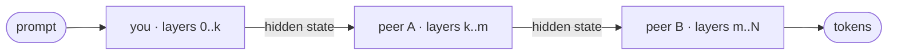
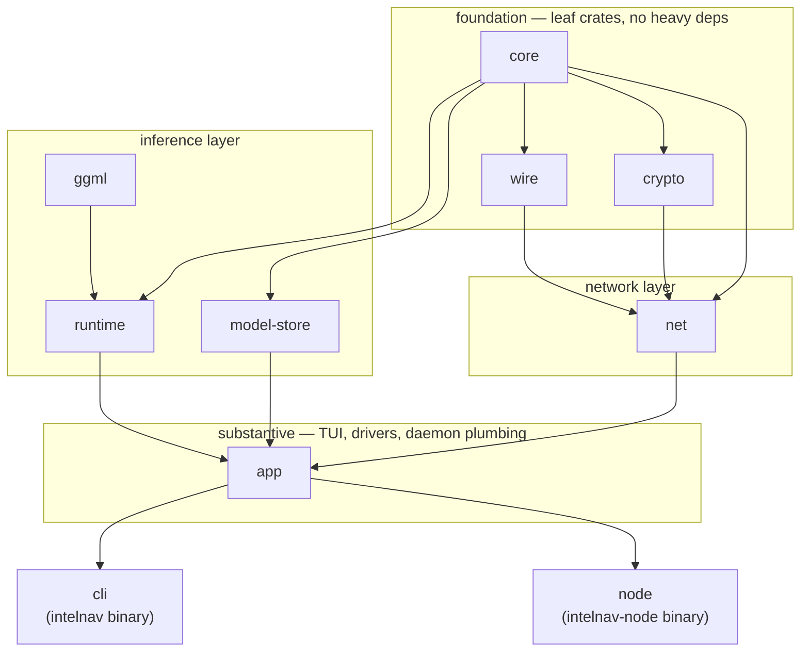

# IntelNav

**Decentralized, pipeline-parallel LLM inference.**

IntelNav splits a model into layer-range slices, scatters them across
volunteer hardware, and streams hidden states through the chain to
answer a prompt. No single peer holds the whole model. Slices are
addressed on a Kademlia DHT, and the only thing a contributor commits
to is the slice they have RAM for.



**Every peer must contribute.** You either host a slice or run as a
DHT relay. There is no leech mode — without contribution, the swarm
collapses into the people running it.

## Two binaries

| binary          | what it does                                                         |
| --------------- | -------------------------------------------------------------------- |
| `intelnav`      | Chat client. TUI for picking models, hosting slices, and managing the daemon. |
| `intelnav-node` | Host daemon. Holds slices, serves chunks, accepts inference forwards. Runs as a systemd user service. |

Both share the same identity (`~/.local/share/intelnav/peer.key`) and
`models_dir`, so they cooperate without IPC. The chat client also
talks to the daemon over a Unix socket (`control.sock`) for
status/leave/service operations.

## Quickstart

```bash
bash scripts/provision.sh                # system deps + rust + libllama
cargo build --release -p intelnav-cli -p intelnav-node
./target/release/intelnav                # opens the TUI
```

First launch:

1. The TUI generates `~/.config/intelnav/config.toml`, an Ed25519
   identity, and an empty `models_dir`. No file editing required.
2. It fetches a freshly-signed bootstrap seed list from the project's
   GitHub release and caches it locally.
3. You're shown a contribution gate. Pick a slice your hardware can
   host, or opt into relay-only mode. Chat is unlocked once you've
   chosen.
4. Selecting a slice runs the contribute flow (download/split or
   swarm pull), then asks `pkexec` once for permission to install
   `intelnav-node` as a user service. The daemon survives reboots
   from then on — no `systemctl` to type, ever.

Inside the TUI:

- `/models` — three-source picker: cached locally, advertised on the
  swarm, available from HuggingFace.
- `/hosting` — slices you currently host with active chain counts;
  drain a slice gracefully with `/leave <cid> <start> <end>`.
- `/service status|install|uninstall` — manage the systemd unit.

## What runs where

`intelnav-node` (one process, one systemd unit) hosts:

- The libp2p swarm with periodic provider record re-announce (5 min).
- The chunk HTTP server (multi-shard, keyed by manifest_cid).
- The forward TCP listener (lazy-loads each slice's GGUF on first
  request, stitches subsets when only chunks are on disk).
- A control RPC over `control.sock` so the chat client can drive
  hosting from the TUI.
- A drain watchdog that force-stops Draining slices whose grace
  period (5 min) elapses, so a wedged consumer can't pin a host
  forever.

## Layout



```
intelnav/
├── crates/
│   ├── core/             shared types, config, errors
│   ├── wire/             CBOR codecs for the protocol
│   ├── crypto/           Ed25519, X25519, AES-256-GCM
│   ├── ggml/             libllama loader + GPU probe
│   ├── runtime/          layer-range inference (ggml-backed)
│   ├── model-store/      GGUF chunker, stitcher, fetcher, multi-shard chunk server
│   ├── net/              libp2p + Kademlia DHT shard index
│   ├── app/              substantive code: TUI, drivers, contribute paths,
│   │                     daemon-hosted forward + chunk + control servers
│   ├── cli/              `intelnav` — chat client (thin binary over `app`)
│   └── node/             `intelnav-node` — host daemon (thin binary over `app`)
├── docs/
│   ├── architecture.md     workspace + protocol overview
│   ├── onboarding-host.md  how to host slices
│   └── onboarding-user.md  how to chat (still mandatory: pick a slice or relay)
└── specs/                wire protocol
```

## Platforms

- **Linux** — systemd user units, single `pkexec` elevation for
  `loginctl enable-linger`. The only supported platform for now
  while the flow gets shaken out in the wild. macOS and Windows
  will follow once Linux is stable.

## Related repos

- [`IntelNav/llama.cpp`](https://github.com/IntelNav/llama.cpp) — our
  patched libllama fork. Layer-range forward + partial-model loader,
  CI builds prebuilt tarballs for `intelnav-node` to dlopen.
- [`IntelNav/web`](https://github.com/IntelNav/web) — the
  [intelnav.net](https://intelnav.net) site. Next.js + Tailwind, static
  export, deployed to seed1's nginx.

## License

Apache-2.0.
