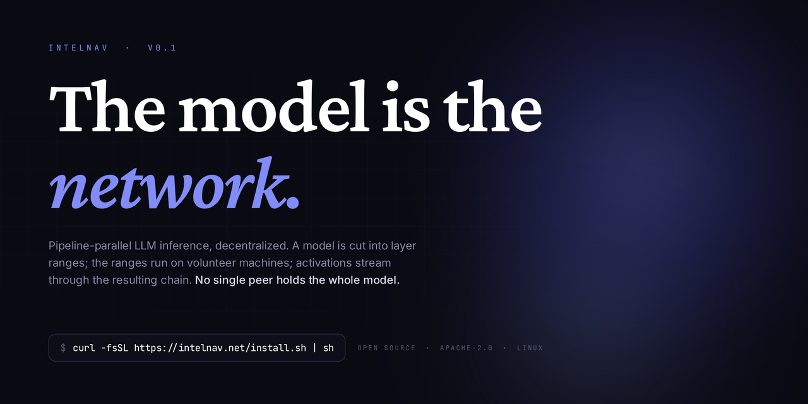
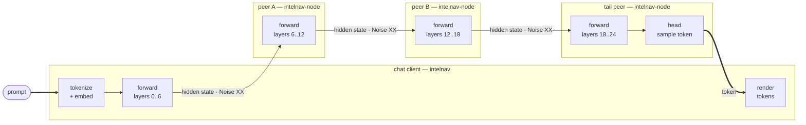
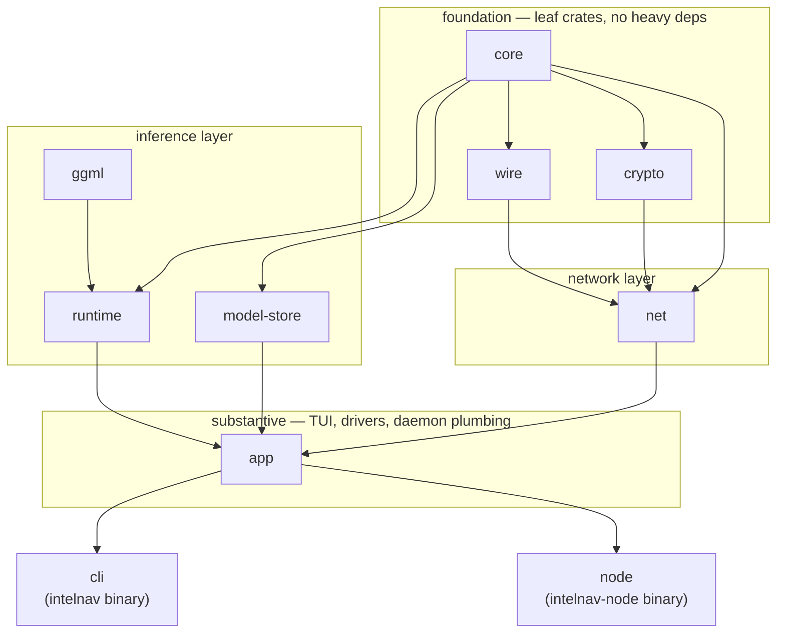

<p align="center">
  
</p>

IntelNav cuts a model into layer ranges, scatters those ranges across
volunteer machines, and streams hidden states through the resulting
chain to answer a prompt. **No single peer holds the whole model.**
Slices are advertised on a Kademlia DHT, signed by the host, and
fetched on demand. A contributor commits RAM for one slice; the rest
of the model lives on other people's boxes.



That's the topology `local-swarm.sh` actually spins up: 24 blocks
of Qwen 2.5 · 0.5B partitioned into four ranges. The chat client
owns the tokenizer, the embedding, and the first slice. Each peer
owns one contiguous range. The tail peer owns the lm-head and
samples a token, which streams back upstream so the client can
render it and start the next forward.

**Mid-chain peers never see plaintext.** What flows between them is
a tensor of activations, not text — by the time the embedding leaves
the chat client it has been folded through *k* non-linear blocks. On
the wire, those activations travel as length-prefixed CBOR
`ForwardHidden` messages, encrypted with Noise XX (X25519 ECDH +
AES-256-GCM). Identities are Ed25519, no bearer tokens.

**Everyone contributes.** You either host a slice or run as a DHT
relay; there is no plain reader mode. A swarm that reads without
giving back is just the people who give back.

## Install

```bash
curl -fsSL https://intelnav.net/install.sh | sh
```

Linux only for now. macOS and Windows follow once Linux is stable in
the wild. From source: see [Install](https://intelnav.net/install/).

## Why decentralized

If you query a hosted model, one company logs the query. They log
the code you couldn't compile, the medical question you wouldn't
ask a doctor, the strategy doc you haven't shown your boss yet.
That's a lot of trust to put in three vendors.

IntelNav doesn't fix that by pinky-swearing not to log. It fixes
it by changing the shape: the chain is the boundary, only the
entry peer sees plaintext, every downstream peer sees opaque
activations. The transport is real cryptography (Noise XX, AES-GCM,
Ed25519 identities, signed advertisements), not "trust us, we
encrypt at rest."

Performance is the trade. Today, a four-hop chain is slower than
a hosted call to GPT or Claude. That's the same place Tor was in
2003 and BitTorrent in 2002, and it's a population problem, not
a protocol problem. The website has the
[full threat model](https://intelnav.net/sovereignty/) including
what the design doesn't defend against.

## Two binaries

| binary          | role                                                                              |
| --------------- | --------------------------------------------------------------------------------- |
| `intelnav`      | Chat client. TUI for picking models, hosting slices, and managing the daemon.     |
| `intelnav-node` | Host daemon. Holds slices, serves chunks, accepts inference forwards. Systemd user service. |

Both share the same identity (`~/.local/share/intelnav/peer.key`) and
`models_dir`, so they cooperate without IPC. The chat client also
talks to the daemon over a Unix socket (`control.sock`) for
status / leave / service operations.

## Quickstart from source

```bash
bash scripts/provision.sh                # system deps + rust + libllama
cargo build --release -p intelnav-cli -p intelnav-node
./target/release/intelnav                # opens the TUI
```

First launch:

1. The TUI writes a default `~/.config/intelnav/config.toml`, an
   Ed25519 identity, and an empty `models_dir`. Nothing to edit
   by hand.
2. It pulls a signed bootstrap seed list from the latest GitHub
   release and caches it.
3. The contribution gate appears: pick a slice your machine can
   host, or take the relay-only path. Chat opens once you've made
   that call.
4. If you picked a slice, the contribute flow runs (download +
   split, or pull from the swarm), then prompts for `pkexec` once
   to install `intelnav-node` as a user-level systemd service.
   After that the daemon comes back on every boot.

Inside the TUI:

- `/models` — three-source picker: cached locally, advertised on the
  swarm, available from HuggingFace.
- `/hosting` — slices you currently host with active chain counts;
  drain a slice gracefully with `/leave <cid> <start> <end>`.
- `/service status|install|uninstall` — manage the systemd unit.

## Try the multi-peer chain on one box

```bash
bash scripts/local-swarm.sh setup           # prepare three peer dirs
bash scripts/local-swarm.sh start           # spawn three intelnav-node daemons
bash scripts/local-swarm.sh ask "what is 17 squared?"
bash scripts/local-swarm.sh stop
```

Three daemons cover layers 6..24 of Qwen 2.5 · 0.5B; the chat
client owns layers 0..6 and the head, then drives the chain.
The protocol is the real one. The sandbox is just that all four
parties live on the same machine; swap loopback addresses for
real hosts and you've got a multi-box swarm. Source: [`scripts/local-swarm.sh`](scripts/local-swarm.sh).

## What `intelnav-node` runs

The daemon is one process, one systemd unit. Inside it:

- A libp2p swarm that re-announces provider records every 5 min.
- An HTTP chunk server, multi-shard, keyed by manifest CID.
- A TCP forward listener that lazy-loads each slice's GGUF on
  first request, and stitches subsets together when only chunks
  are on disk.
- A control RPC over `control.sock`, so the TUI can drive hosting
  without IPC ceremony.
- A drain watchdog that force-stops slices whose graceful drain
  exceeded its grace window (5 min), so a wedged consumer cannot
  pin a host indefinitely.

## Crate layout



```
intelnav/
├── crates/
│   ├── core/             shared types, config, errors
│   ├── wire/             CBOR codecs for the protocol
│   ├── crypto/           Ed25519, X25519, AES-256-GCM
│   ├── ggml/             libllama loader + GPU probe
│   ├── runtime/          layer-range inference (ggml-backed)
│   ├── model-store/      GGUF chunker, stitcher, fetcher, multi-shard chunk server
│   ├── net/              libp2p + Kademlia DHT shard index
│   ├── app/              substantive code: TUI, drivers, contribute paths,
│   │                     daemon-hosted forward + chunk + control servers
│   ├── cli/              `intelnav` — chat client (thin binary over `app`)
│   └── node/             `intelnav-node` — host daemon (thin binary over `app`)
├── docs/
│   ├── architecture.md     workspace + protocol overview
│   ├── onboarding-host.md  how to host slices
│   └── onboarding-user.md  how to chat (still mandatory: pick a slice or relay)
├── scripts/
│   ├── provision.sh        system deps + rust + libllama
│   └── local-swarm.sh      reproducible 3-peer chain on one machine
└── specs/                  wire protocol
```

## Related repos

- [`IntelNav/llama.cpp`](https://github.com/IntelNav/llama.cpp) — patched
  libllama fork. Layer-range forward + partial-model loader; CI builds
  prebuilt tarballs that `intelnav-node` `dlopen`s at runtime.
- [`IntelNav/web`](https://github.com/IntelNav/web) — the
  [intelnav.net](https://intelnav.net) site. Next.js, static export,
  deployed to seed1's nginx.

## License

Apache-2.0.
